# Insurance Risk & Pricing Analytics Dashboard

## End-to-End Portfolio Risk Analysis and Strategic Decision Framework

---

## 1. Project Objective

This project investigates a structurally unprofitable insurance portfolio exhibiting persistent financial losses across multiple regions.

The analysis aims to:

* Identify key drivers of financial underperformance
* Quantify the impact of claim behavior across segments
* Detect non-random fraud patterns
* Provide actionable recommendations for pricing and risk management

The portfolio currently shows a **cumulative deficit of -$48.9M**, indicating systemic issues in pricing and risk segmentation.

---

## 2. Data Source

Dataset: `insurance_claims.csv`
Source: Mendeley Data (public dataset)

Each row represents an individual insurance claim, including:

* Policyholder demographics
* Claim characteristics
* Financial variables
* Fraud indicator (`fraud_reported`)

---

## 3. Data Pipeline

### 3.1 SQL — Data Structuring

* Extracted relevant claim-level data
* Aggregated by:

  * State
  * Age group
  * Incident type
* Built structured analytical tables for downstream modeling

---

### 3.2 R — Data Processing and Feature Engineering

Key transformations:

```r
df$loss_ratio <- df$claim_amount / df$policy_annual_premium
df$age_group <- cut(df$age, breaks = c(0,30,40,50,60,100))
```

Additional processing:

* Data cleaning and validation
* Feature engineering:

  * Loss Ratio
  * Claim Frequency
  * Fraud Rate
* Construction of enhanced analytical datasets

---

### 3.3 Power BI — Dashboard Development

* Built interactive dashboards for portfolio monitoring
* Defined KPIs:

  * Total Claims
  * Profit / Loss
  * Loss Ratio
  * Fraud Rate
* Enabled multi-dimensional filtering:

  * Geography
  * Demographics
  * Incident type

---

## 4. Dashboard Outputs

### Portfolio Overview

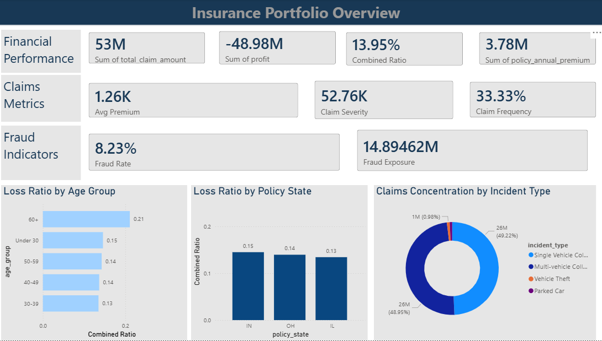

### Risk and Fraud Monitoring

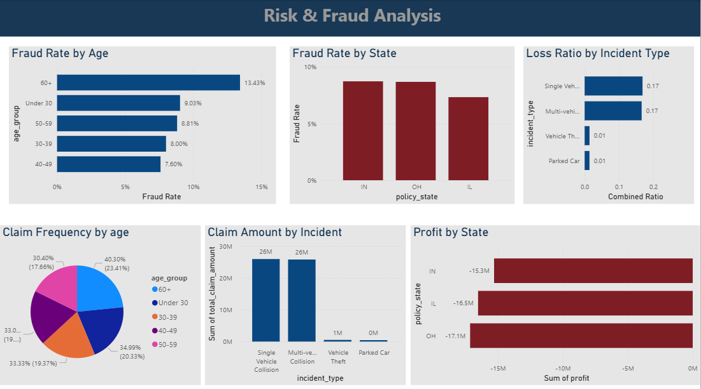

---

## 5. Analytical Findings

The following section summarizes the key insights derived from the analytical workflow and presentation outputs.

---

### 5.1 Regional Financial Performance

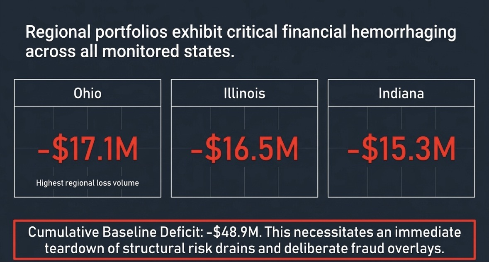

* Ohio: -$17.1M
* Illinois: -$16.5M
* Indiana: -$15.3M

All regions exhibit significant losses, confirming that the issue is structural rather than localized.

---

### 5.2 Regional Risk Comparison

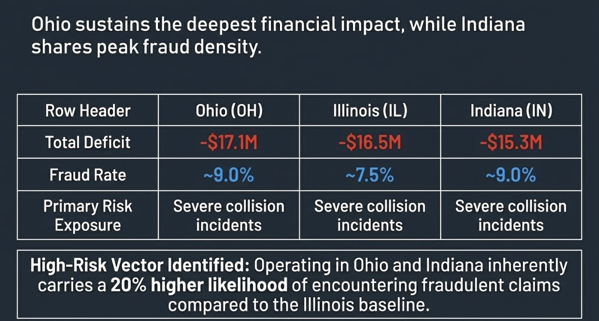

Ohio and Indiana display:

* Higher fraud rates
* Greater financial exposure

This suggests uneven risk distribution across jurisdictions.

---

### 5.3 Claim Frequency Distribution

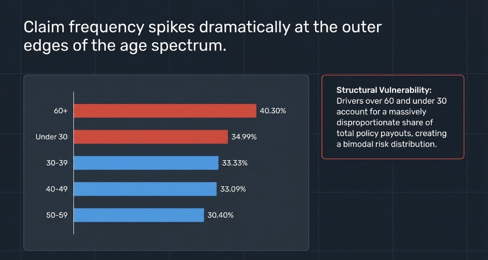

Claim frequency is disproportionately concentrated at the extremes:

* Age 60+
* Under 30

This creates a bimodal risk structure.

---

### 5.4 Loss Ratio Segmentation

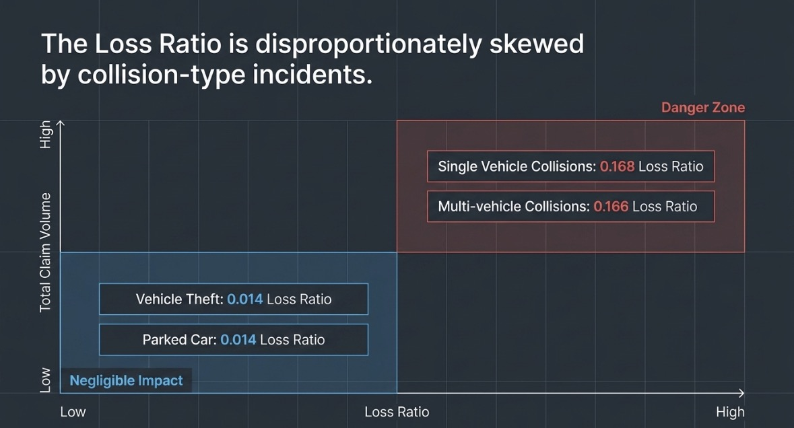

* Collision claims: ~0.168 loss ratio
* Other claims: ~0.014

This reveals a major imbalance in pricing relative to risk.

---

### 5.5 Demographic Risk Drivers

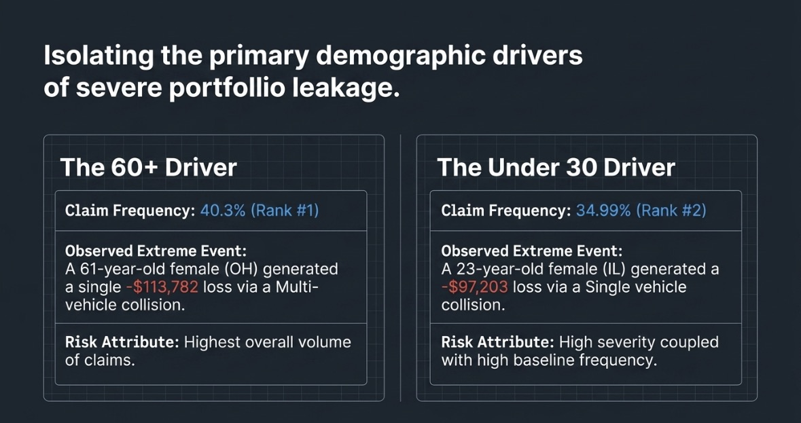

* Older drivers generate the highest claim volume
* Younger drivers exhibit higher severity

---

### 5.6 Loss Concentration

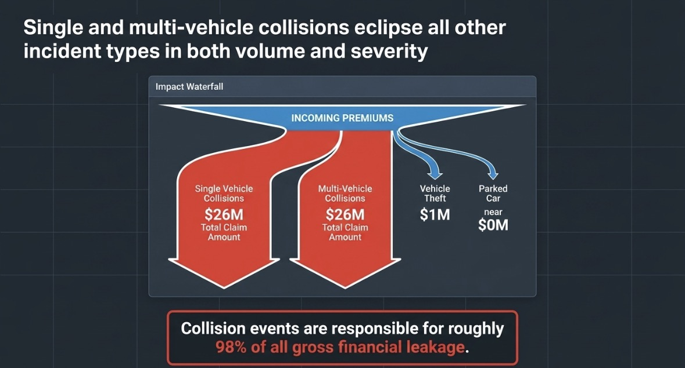

Approximately **98% of total financial losses** originate from collision-related incidents.

---

### 5.7 Fraud Interaction Model

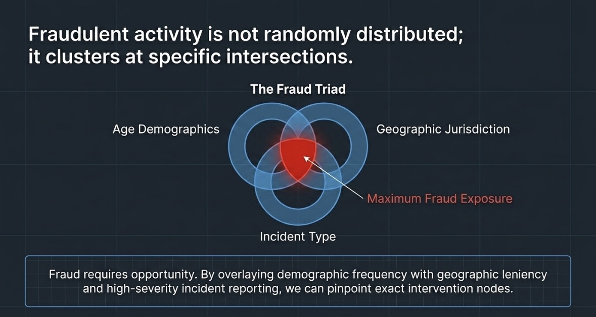

Fraud is not randomly distributed.
It emerges from the interaction of:

* Age demographics
* Geographic regions
* Incident types

---

### 5.8 High-Risk Intersection

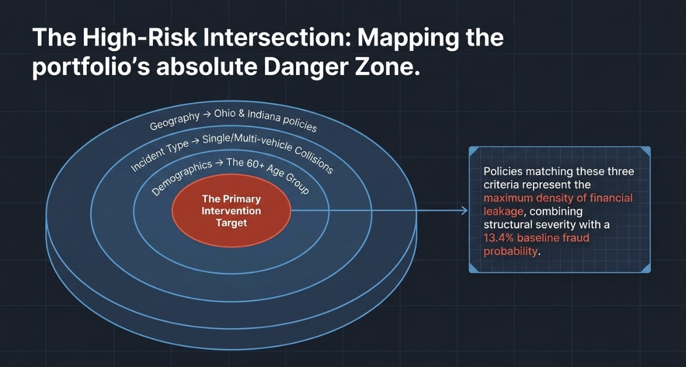

The highest-risk cluster is defined by:

* Geography: Ohio and Indiana
* Incident type: Collision claims
* Demographics: Age 60+

This segment represents the primary intervention target.

---

### 5.9 Fraud Rate by Demographics

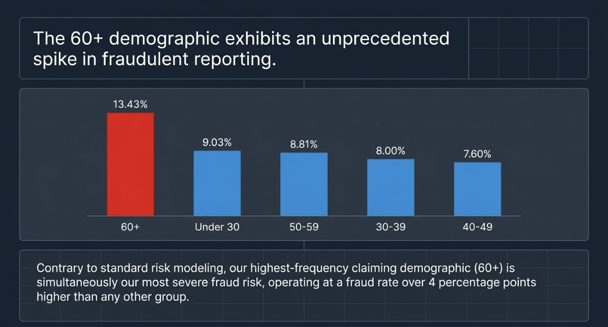

* Age 60+ exhibits a fraud rate of 13.43%
* This is significantly higher than all other groups

---

## 6. Key Insights

1. The portfolio is structurally unprofitable across all regions
2. Financial losses are overwhelmingly driven by collision claims
3. Risk is concentrated at demographic extremes
4. Fraud patterns are predictable and cluster-based

---

## 7. Strategic Recommendations

### Pricing Adjustments

* Recalibrate premiums for high-risk demographics
* Align pricing with observed loss ratios

---

### Fraud Detection Enhancements

* Introduce mandatory review for:

  * High-value claims
  * High-risk demographic segments
* Deploy predictive fraud indicators

---

### Risk Management Focus

* Prioritize intervention in Ohio and Indiana
* Target collision-heavy portfolios

---

## 8. Project Structure

```
Insurance-Risk-Pricing-Dashboard/
│
├── data/
├── SQL/
├── R/
├── PowerBI/
├── outputs/
├── presentation/
└── README.md
```

---

## 9. Author

Abdoul Aziz Sarr
Bilingual Data Analyst (EN/FR)
GitHub: https://github.com/abdouazizsarr915-code
